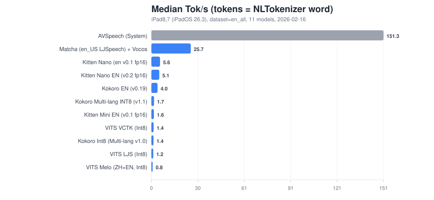

# ios-offline-tts-eval

SwiftUI app for evaluating on-device TTS engines/models on iOS (physical devices only).

### Benchmark (iPad Pro 3rd gen)



Engines (v1.1):
- `AVSpeechSynthesizer` (system baseline)
- `SherpaOnnxKit` Offline TTS (ONNX Runtime, CPU) with curated presets (Kokoro, VITS, Matcha+Vocos, Kitten)
- `ONNX Runtime` (CPU) NeMo FastPitch + HiFiGAN (local bundle import; no weights redistributed)

No iOS Simulators are used or required.

## Setup

This repo expects to be cloned next to `ios-android-offline-speech-translation/` (it uses the shared `LocalPackages/SherpaOnnxKit` path dependency):

```
<parent>/
  ios-offline-tts-eval/
  ios-android-offline-speech-translation/
```

1. Prepare SherpaOnnxKit binary deps (shared from the translation repo):

```bash
./scripts/setup-ios-deps.sh
```

2. Generate Xcode project:

```bash
xcodegen generate
```

3. Build/install to a physical device:

```bash
IOS_COREDEVICE_ID=<CoreDevice ID> IOS_DEVICE_UDID=<UDID> ./scripts/install-device.sh
```

## NeMo (Local Bundle Import)

NeMo ONNX weights are **not** downloaded by the app (and are not redistributed by this repo). Instead, export/pick a local bundle directory containing:

- `fastpitch.onnx`
- `hifigan.onnx`
- `symbols.json`
- `config.json`

Then push it into the app container and import on-device:

```bash
IOS_COREDEVICE_ID=<CoreDevice ID> IOS_DEVICE_UDID=<UDID> \
  MODEL_ID=nemo-fastpitch-hifigan-en \
  BUNDLE_DIR=/path/to/your/nemo-bundle-dir \
  ./scripts/nemo/push_bundle_to_device.sh
```

Open the app and visit **Models** to import.

Find connected devices:

```bash
xcrun devicectl list devices
xcrun xctrace list devices
```

## Benchmark (Physical Device)

Run the full benchmark on the device and pull exported JSON/CSV into `device-exports/`:

```bash
IOS_COREDEVICE_ID=<CoreDevice ID> IOS_DEVICE_UDID=<UDID> \
  TTSEVAL_LANG=en TTSEVAL_DATASET=all TTSEVAL_PROMPT_LIMIT=0 \
  ./scripts/test-all-device.sh
```

Update README benchmark table + regenerate the tok/s SVG from the latest `device-exports/**/results-*.json`:

```bash
python3 scripts/generate-benchmark-report.py --update-readme
```

<!-- BENCHMARK_RESULTS_START -->
### Latest Benchmark

- Device: `iPad8,7` (iPadOS 26.3)
- Dataset: `en_all`
- Started: `2026-02-16T03:13:52Z`


| Model | Engine | Prompts | Median Tok/s |
|---|---|---:|---:|
| AVSpeech (System) | `native.avspeech` | 12 | 151.34 |
| Matcha (en_US LJSpeech) + Vocos | `sherpa.offline` | 12 | 25.68 |
| Kitten Nano (en v0.1 fp16) | `sherpa.offline` | 12 | 5.61 |
| Kitten Nano EN (v0.2 fp16) | `sherpa.offline` | 12 | 5.14 |
| Kokoro EN (v0.19) | `sherpa.offline` | 12 | 4.01 |
| Kokoro Multi-lang INT8 (v1.1) | `sherpa.offline` | 12 | 1.71 |
| Kitten Mini EN (v0.1 fp16) | `sherpa.offline` | 12 | 1.63 |
| VITS VCTK (Int8) | `sherpa.offline` | 12 | 1.43 |
| Kokoro Int8 (Multi-lang v1.0) | `sherpa.offline` | 12 | 1.40 |
| VITS LJS (Int8) | `sherpa.offline` | 12 | 1.20 |
| VITS Melo (ZH+EN, Int8) | `sherpa.offline` | 12 | 0.83 |
<!-- BENCHMARK_RESULTS_END -->

## Notes

- Models are downloaded at runtime from Hugging Face and cached under Application Support.
- For device signing from CLI, `project.local.yml` is used if present. Copy `project.local.yml.example` to `project.local.yml` and set `DEVELOPMENT_TEAM` / `PRODUCT_BUNDLE_IDENTIFIER` as needed.
